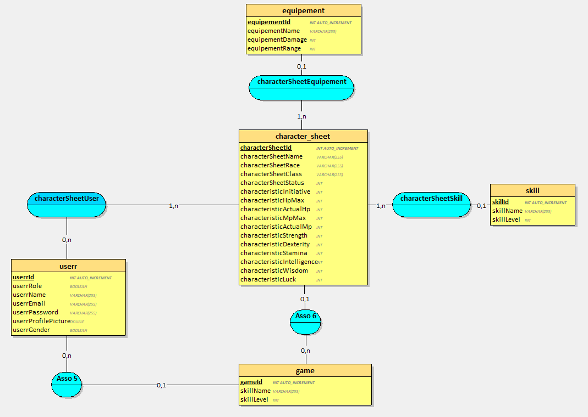

# Patefinder

## Ceci est un projet php de groupe sur un site de jeu de role

---

**BDD**

Il y a 2 documents sql :

-   Le dossier **["patefinder.sql"](./ressources/patefinder.sql)** contient toutes les tables vident.
-   Le document **["patefinderInsert.sql"](./ressources/patefinderAvecDonnees.sql)** contient toutes les tables avec directement des données dans les tables.

---

**MCD**

---

**Pseudo et mot de passe des 2 Utilisateurs dans la base de donnée :**

**MJ :**

-   **pseudo** : testmj
-   **mot de passe** : testmj

**Joueur:**

-   **pseudo** : testjoueur
-   **mot de passe** : testjoueur

---

**Équipe :**
@azuera , @Vlndo , @MathiasDAHA , RealHich69

**Avec l'aide de :**
@Dreeckan
